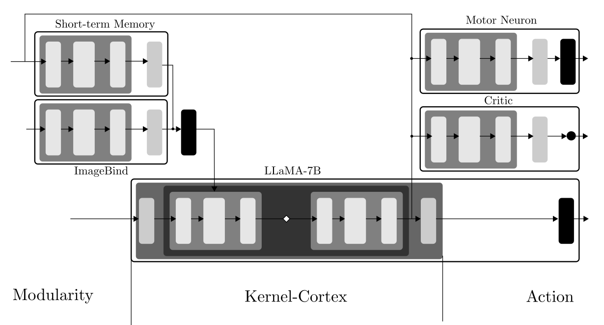

# LLM-SelfCritic
Adapt &amp; FineTune LLM for Critic Thought

**LLM-AutoCritic** is based on [Falcon-7B](https://huggingface.co/tiiuae/falcon-7b).

  - Model type: Causal decoder with evaluation output;
  - Language(s) (NLP) : English and French;

**Perpective :**

**To Read about Causality :**

	- https://arxiv.org/abs/2306.05836
	- https://arxiv.org/abs/2305.00050

**To Read about Control&Robotic with LLM :**

	- https://github.com/GT-RIPL/Awesome-LLM-Robotics

**Attribution required : Fabien Furfaro (CC 4.0 BY NC ND SA)**
